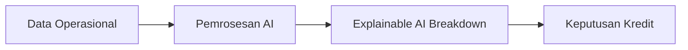

# TrustFleet AI — Intelegensi Fintech & Penilaian Kredit Alternatif

[](https://trustfleet-ai.vercel.app)
[](https://nextjs.org/)
[](https://tailwindcss.com/)

**TrustFleet AI** adalah platform dashboard internal intelijen finansial yang dirancang khusus untuk tim **Finance dan Credit Analyst** (khususnya untuk ekosistem logistik armada seperti Astra UD Trucks). Platform ini bertujuan menjembatani kesenjangan antara data operasional armada logistik yang dinamis dengan penilaian risiko kredit tradisional untuk memfasilitasi keputusan pembiayaan yang cepat, akurat, dan transparan.

🔗 **Live Demo:** [https://trustfleet-ai.vercel.app](https://trustfleet-ai.vercel.app)

---

## 📌 Apa itu TrustFleet AI?

Di industri logistik, penilaian kelayakan kredit secara tradisional membutuhkan waktu berhari-hari dan seringkali tidak akurat karena hanya mengandalkan data keuangan historis yang lambat diperbarui. 

**TrustFleet AI** hadir sebagai solusi dengan memanfaatkan kecerdasan buatan (AI) untuk menganalisis data operasional armada secara *real-time*—termasuk riwayat servis, pembelian suku cadang, aktivitas telematika armada, dan perilaku pembayaran—kemudian mengonversinya menjadi **Skor Kredit Alternatif (Alternative Credit Score)** yang andal dan dapat dijelaskan secara transparan.

---

## 🎯 Tujuan Utama Sistem

1. **Mempercepat Pengambilan Keputusan Kredit:** Memangkas waktu proses evaluasi dari hitungan hari menjadi instan (*real-time*).
2. **Mitigasi Risiko Proaktif:** Mendeteksi potensi gagal bayar (*default*) hingga **90 hari lebih awal** menggunakan pemodelan prediktif berbasis data operasional.
3. **Transparansi Keputusan (Explainable AI):** Menghilangkan sistem "kotak hitam" (black box) keputusan kredit dengan memvisualisasikan faktor pendukung dan penghambat skor secara transparan bagi Credit Analyst.
4. **Integrasi Data Terpadu:** Mengintegrasikan telematika, ERP logistik, dan data perbankan ke dalam satu dasbor tunggal (Customer 360).

---

## 🔄 Cara Kerja Sistem

Sistem ini memproses data operasional armada melalui 4 tahapan utama:



### 1. Agregasi Data Operasional
Platform mengumpulkan metrik operasional pelanggan dari berbagai sensor dan sistem:
* **Service History:** Frekuensi perawatan rutin, riwayat perbaikan darurat, dan kepatuhan servis berkala.
* **Spare Parts Purchase:** Volume transaksi suku cadang asli dan pola pembelian bulanan.
* **Fleet Activity (Telematics):** Jarak tempuh, rute armada, konsumsi bahan bakar, dan jam operasional kendaraan secara *real-time*.
* **Credit History:** Riwayat performa pembayaran tagihan pembiayaan sebelumnya.

### 2. Alternative Credit Scoring Model (AI)
Menggunakan model prediktif berbasis AI untuk mengkalkulasi metrik operasional menjadi satu nilai tunggal yang komprehensif, yaitu **Skor Armada (Fleet Score)** dengan skala 0 - 1000 serta klasifikasi rating kredit (contoh: *Institusional A+*).

### 3. Visualisasi Explainable AI (XAI)
Alih-alih hanya menampilkan skor akhir, sistem merinci variabel penentu keputusan secara visual:
* **Faktor Positif (Drivers):** Kepatuhan servis yang tinggi, rute stabil, dan penggunaan suku cadang asli.
* **Faktor Risiko (Risk Factors):** Fluktuasi penggunaan bahan bakar yang ekstrem, penurunan jarak tempuh bulanan secara drastis, atau keterlambatan minor.

### 4. Workflow Keputusan Kredit (Decisioning Flow)
Analisis dilakukan melalui dasbor visual interaktif:
* **Credit Analyst** mengkaji detail data operasional pada profil **Customer 360** dan memvalidasi **Credit Scoring Detail**.
* Analyst merekomendasikan salah satu keputusan:
  * **Approve:** Menyetujui batas kredit yang direkomendasikan sistem.
  * **Review:** Mengajukan peninjauan ulang dengan menyertakan catatan analisis tambahan.
  * **Decline:** Menolak pengajuan pembiayaan dengan memilih alasan penolakan sistemik.
* **Finance Manager** memberikan persetujuan final secara sistemik.

---

## 📁 Struktur Peta Informasi (Information Architecture)

* **Splash Screen:** Pintu masuk aplikasi dengan simulasi loading progress bar yang responsif.
* **Dashboard (Home):** Panel utama yang menampilkan ringkasan risiko portofolio kredit, distribusi level risiko, dan aktivitas scoring terbaru.
* **Customer 360:** Daftar direktori pelanggan armada dengan rincian data operasional (servis, suku cadang, telematika).
* **Credit Scoring:** Halaman analisis mendalam mengenai skor kredit armada dan fitur Explainable AI (XAI).
* **Risk Analytics:** Peta sebaran risiko armada melalui bagan interaktif serta tabel metrik risiko.
* **Reports:** Fitur eksportasi data laporan untuk kebutuhan audit internal.
* **Settings:** Konfigurasi akun personal, preferensi notifikasi, dan pengelolaan hak akses pengguna.

---

## 🛠️ Teknologi yang Digunakan

* **Framework:** Next.js 16.2.9 (App Router)
* **Styling:** Tailwind CSS v4 & Vanilla CSS
* **Bahasa:** TypeScript
* **Ikon:** Google Fonts (Material Symbols Outlined)
* **Komponen Modal & Notifikasi:** SweetAlert2 & Custom HTML5 Modal overlays
* **Hosting/Deploy:** Vercel

---

## 💻 Cara Menjalankan secara Lokal

1. **Klon Repositori:**
   ```bash
   git clone https://github.com/EkoMuhammadRizki/TrustFleet-AI.git
   cd TrustFleet-AI
   ```

2. **Instal Dependensi:**
   ```bash
   npm install
   ```

3. **Jalankan Server Development:**
   ```bash
   npm run dev
   ```

4. **Buka Aplikasi:**
   Buka peramban dan navigasikan ke [http://localhost:3000](http://localhost:3000).

---

© 2024 TrustFleet AI Inc. Hak cipta dilindungi undang-undang.
