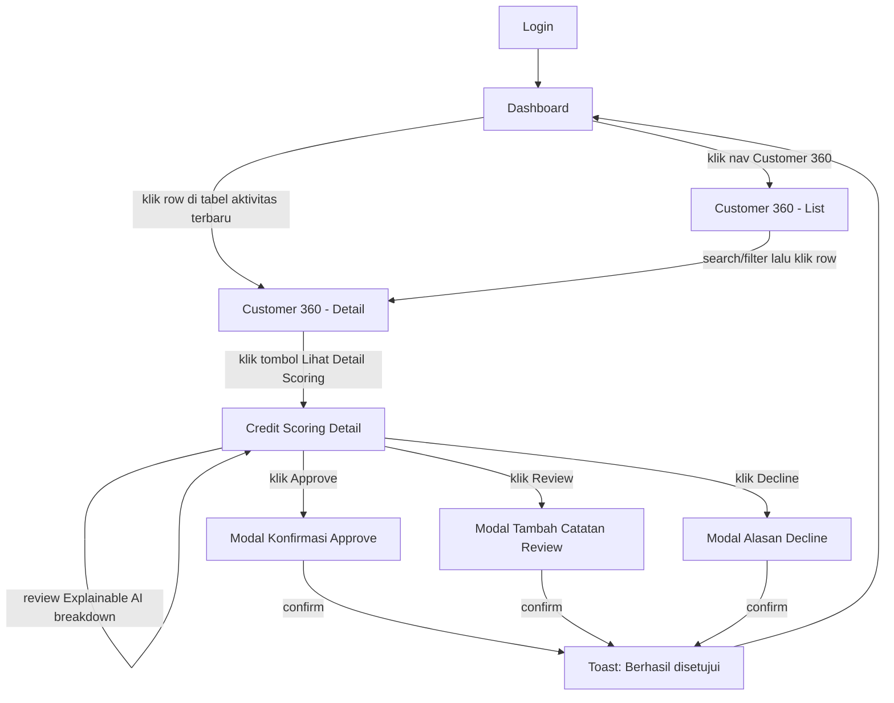

# Flow.md — TrustFleet AI

User Flow & Information Architecture untuk kebutuhan **clickable prototype** (Figma/Stitch). Disusun berdasarkan design system yang sudah dikunci sebelumnya (sidebar: Dashboard, Customer 360, Credit Scoring, Risk Analytics, Reports, Settings).

---

## 1. Overview

TrustFleet AI adalah dashboard internal untuk tim **Finance/Credit Analyst** Astra UD Trucks. Tujuan utama produk: mengubah data operasional pelanggan armada (servis, sparepart, aktivitas armada) menjadi **Alternative Credit Score**, lalu membantu tim finance mengambil keputusan pembiayaan (Approve / Review / Decline) secara cepat dan transparan (Explainable AI).

**Primary user goal:** dari sekumpulan pelanggan → temukan satu pelanggan → lihat skor & alasan skornya → ambil keputusan kredit.

---

## 2. User Roles

| Role | Akses | Tujuan utama |
|---|---|---|
| **Credit Analyst** (primary persona) | Lihat semua data, ajukan rekomendasi | Review & rekomendasi kredit per customer |
| **Finance Manager** | Sama seperti analyst + approval final | Approve/Decline keputusan akhir |
| **Admin** | Semua akses + Settings/user management | Kelola user, konfigurasi sistem |

> Untuk clickable prototype tahap awal, cukup desain 1 role (Credit Analyst) dulu — role lain bisa pakai variasi permission di iterasi berikutnya.

---

## 3. Information Architecture (Sitemap)

```
TrustFleet AI
│
├── Login
│
└── App Shell (Sidebar + Header — persistent di semua halaman setelah login)
    │
    ├── 1. Dashboard (home)
    │
    ├── 2. Customer 360
    │   └── Customer Detail (per customer)
    │       ├── Tab: Overview
    │       ├── Tab: Service History
    │       ├── Tab: Spare Parts Purchase
    │       ├── Tab: Fleet Activity
    │       └── Tab: Credit History
    │
    ├── 3. Credit Scoring
    │   └── Credit Scoring Detail (per customer)
    │       ├── Score Gauge
    │       ├── Explainable AI Breakdown
    │       └── Credit Recommendation (Approve/Review/Decline)
    │
    ├── 4. Risk Analytics
    │   ├── Data Table (semua customer)
    │   ├── Risk Heatmap/Scatter
    │   └── Trend Chart
    │
    ├── 5. Reports
    │   ├── Report List
    │   └── Generate/Export Report
    │
    └── 6. Settings
        ├── Profile
        ├── Notification Preferences
        └── User Management (Admin only)
```

---

## 4. Daftar Screen & Tujuan

| # | Screen | Tujuan | Entry point |
|---|---|---|---|
| 1 | Login | Autentikasi user | URL langsung |
| 2 | Dashboard | Ringkasan portfolio risiko & aktivitas terbaru | Setelah login |
| 3 | Customer 360 (List) | Cari/filter daftar pelanggan | Sidebar |
| 4 | Customer 360 (Detail) | Lihat profil lengkap 1 pelanggan | Klik row di list / klik card di Dashboard |
| 5 | Credit Scoring Detail | Lihat skor, alasan skor, ambil keputusan | Klik "Lihat Detail Scoring" dari Customer 360 |
| 6 | Risk Analytics | Eksplorasi data risiko keseluruhan portfolio | Sidebar |
| 7 | Reports | Generate & download laporan | Sidebar |
| 8 | Settings | Kelola profil & preferensi | Avatar menu / Sidebar |

---

## 5. Primary User Flow (Happy Path)

**Skenario:** Credit Analyst mengevaluasi customer baru dan memberi keputusan kredit.



**Langkah detail:**
1. User login → diarahkan ke **Dashboard**.
2. Dashboard menampilkan KPI cards + tabel "Aktivitas Scoring Terbaru". User klik salah satu baris customer.
3. Masuk ke **Customer 360 Detail** — lihat ringkasan profil & tab data operasional.
4. User klik tombol pill **"Lihat Detail Scoring"** di side panel.
5. Masuk ke **Credit Scoring Detail** — lihat gauge skor + breakdown Explainable AI.
6. User mengambil keputusan: **Approve / Review / Decline** (tombol pill, warna sesuai status: hijau/amber/merah).
7. Muncul **modal konfirmasi** sesuai pilihan (Decline & Review butuh input catatan/alasan; Approve cukup konfirmasi).
8. Setelah confirm → **toast notification** sukses → redirect kembali ke Dashboard, status customer ter-update di tabel.

---

## 6. Secondary Flows

### 6.1 Search & Filter Customer
```
Customer 360 (List) → ketik di search bar (pill, rounded-full)
                     → hasil ter-filter realtime
                     → opsional: klik filter chip (Risk Level / Industry)
                     → klik row → Customer 360 Detail
```

### 6.2 Eksplorasi Risk Analytics
```
Sidebar → Risk Analytics → pilih filter chip (date range, risk level, industry)
        → tabel & chart ter-update
        → klik row customer di tabel → Customer 360 Detail (cross-navigation)
        → klik "Export Report" → trigger flow Reports (6.3)
```

### 6.3 Generate Report
```
Sidebar → Reports → klik "Generate Report" (pill button)
        → modal: pilih jenis report + periode
        → klik Generate → loading state → file siap → tombol Download muncul
```

### 6.4 Notifikasi
```
Header → klik ikon bell → dropdown/panel notifikasi muncul
       → klik salah satu notifikasi (mis. "Customer X butuh review")
       → langsung navigasi ke Credit Scoring Detail customer terkait
```

### 6.5 Settings & Logout
```
Header → klik avatar → dropdown (Profile, Settings, Logout)
       → Profile/Settings → halaman Settings dengan tab (Profile, Notifikasi, User Management)
       → Logout → konfirmasi modal → redirect ke Login
```

---

## 7. Screen States (wajib didesain untuk prototype yang realistis)

Setiap screen yang menampilkan data sebaiknya punya minimal 4 state berikut supaya clickable prototype terasa nyata:

| State | Contoh kondisi |
|---|---|
| **Default/Loaded** | Data tersedia, tampilan normal |
| **Loading** | Skeleton loader saat fetch data (KPI cards, tabel, chart) |
| **Empty** | Belum ada customer/report (mis. filter tidak menghasilkan apa-apa) — tampilkan ilustrasi + pesan + CTA |
| **Error** | Gagal load data — pesan error + tombol "Coba Lagi" |

Khusus **Credit Scoring Detail**, tambahkan state:
- **Belum display (Not Scored)** — customer belum punya skor, tampilkan CTA "Jalankan Scoring".
- **Scoring in progress** — loading dengan progress indicator (proses AI sedang berjalan).

---

## 8. Modal & Overlay List

| Modal | Trigger | Isi |
|---|---|---|
| Confirm Approve | Tombol Approve | Ringkasan customer + recommended limit + tombol Confirm/Cancel |
| Review Note | Tombol Review | Textarea catatan + tombol Submit/Cancel |
| Decline Reason | Tombol Decline | Dropdown alasan + textarea + tombol Submit/Cancel |
| Generate Report | Tombol Generate Report | Pilih jenis & periode report |
| Logout Confirm | Klik Logout | Konfirmasi ya/tidak |
| Notification Panel | Klik ikon bell | List notifikasi (bukan full modal, bisa dropdown) |

---

## 9. Navigation Rules

- **Sidebar** persistent di semua halaman setelah login, item aktif selalu ter-highlight pill biru sesuai halaman yang sedang dibuka.
- **Breadcrumb** dipakai di halaman detail (mis. `Customer 360 / PT Sumber Jaya Logistik`) supaya user tahu posisi & bisa klik back ke list.
- **Back button browser/Cancel button** di modal selalu kembali ke state sebelumnya tanpa menyimpan perubahan.
- **Cross-navigation** diperbolehkan antar modul (mis. dari Risk Analytics klik customer → langsung ke Customer 360 Detail) — ini penting buat clickable prototype biar testing flow terasa natural, bukan cuma linear.

---

## 10. Clickable Prototype Checklist

Saat bikin link/interaksi di Figma atau Stitch, pastikan elemen-elemen ini clickable:

- [ ] Sidebar nav items (6 menu) → masing-masing ke halaman terkait
- [ ] Logo/header → kembali ke Dashboard
- [ ] Avatar → dropdown (Profile, Settings, Logout)
- [ ] Notification bell → notification panel
- [ ] Search bar → (untuk prototype, bisa langsung trigger filtered state)
- [ ] Tabel row (Dashboard, Customer 360 List, Risk Analytics) → ke Customer 360 Detail
- [ ] Tab segmented control di Customer 360 Detail → switch antar tab (Overview/Service History/dst)
- [ ] Tombol "Lihat Detail Scoring" → Credit Scoring Detail
- [ ] Tombol Approve/Review/Decline → modal terkait
- [ ] Tombol Confirm/Submit di modal → toast + redirect
- [ ] Filter chips (Risk Analytics) → update tampilan (state filtered)
- [ ] Tombol "Export/Generate Report" → modal Reports
- [ ] Tombol Download report → simulasi file ready

---

## 11. Rekomendasi Tools untuk Prototyping

- **Stitch → Figma:** kalau Stitch sudah generate semua screen, import/copy ke Figma untuk bikin link interaktif (Prototype tab), karena Stitch sendiri belum punya prototyping flow selengkap Figma.
- Gunakan **Smart Animate** di Figma untuk transisi antar tab (Customer 360) dan modal open/close supaya terasa lebih natural saat di-demo.
- Untuk komponen yang berulang (Sidebar, Header, Pill Button, Badge), jadikan **Figma Component** — biar pas nanti convert ke Next.js, mapping ke React component juga jadi 1:1 lebih gampang.

---

### Catatan
Flow ini sengaja dirancang non-linear (banyak cross-navigation) sesuai best practice dashboard B2B — user jarang jalan lurus dari Dashboard → Detail → Selesai, biasanya bolak-balik antar modul (Risk Analytics ↔ Customer 360 ↔ Credit Scoring). Pastikan link prototype mengakomodasi ini, bukan cuma satu jalur "happy path" doang.
